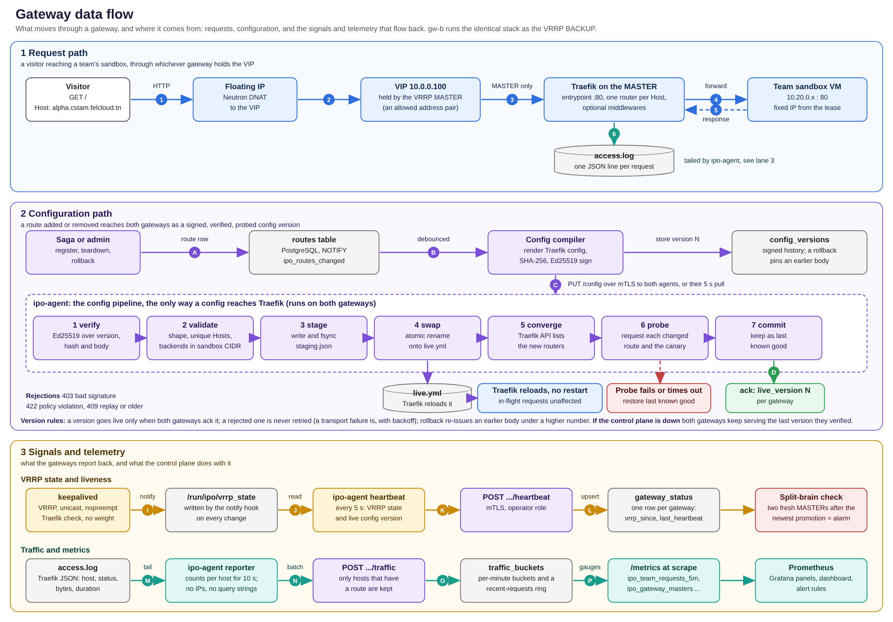

# Resilient IP Optimizer

A platform that gives every team in the **IEEE CSTAM 3.0 × FelCloud** challenge an isolated
sandbox VM on OpenStack and a stable public subdomain (`<team>.cstam.felcloud.tn`), all behind
**one floating IP**. A VRRP gateway pair keeps serving when a gateway VM or its proxy dies, and a
control plane creates, routes, repairs and removes sandboxes automatically.


## What it does

- **Register a team, get a subdomain in seconds.** A pool of pre-booted VMs is claimed, a signed
  route is pushed to both gateways, and the host starts answering with no proxy restart.
- **Survive failure.** The gateway pair fails over in about 0.6 s when a VM dies and 1.2 to 1.7 s
  when Traefik dies, measured under load with the real software
  ([OpenStack HA](docs/architecture/openstack-ha.md)).
- **Never trust the control plane blindly.** Configs are Ed25519-signed, and each agent
  re-validates them, probes every change, and rolls back on failure.
- **Isolate sandboxes.** One policy file, enforced by Neutron security groups and by nftables on
  every host, probed 1,683 ways in a lab ([results](docs/reports/isolation.md)).
- **Clean up after itself.** Leases expire, routes are removed before VMs, addresses are
  quarantined, and a reconciler repairs any drift.
- **Be operable.** A dashboard, per-team traffic, alerts, runbooks, a hash-chained audit log.

## Gateway data flow



*Request path, configuration path, and the signals and telemetry that flow back. Walked through
step by step in [gateway data flow](docs/architecture/gateway-data-flow.md).*

## Try it

```bash
# the interactive demo: two real gateways, failover, hot reload, split brain (about a minute)
cd tests && sh lab/fetch-tools.sh && uv run python -m chaos.demo

# the control plane on a laptop, no OpenStack needed: see docs/guides/getting-started.md
cd control-plane && uv sync && uv run pytest -q
```

Needs Linux with unprivileged user namespaces; no root. Everything else is in
[getting started](docs/guides/getting-started.md).

## Documentation

| | |
| --- | --- |
| **[System architecture](docs/architecture/system-architecture.md)** | components, networks, decisions, limits |
| **[OpenStack high availability](docs/architecture/openstack-ha.md)** | failover, split brain, every failure mode, findings from the real cloud |
| **[Gateway data flow](docs/architecture/gateway-data-flow.md)** | the three paths through a gateway |
| [Control plane](docs/architecture/control-plane.md), [Security](docs/architecture/security.md) | lifecycle, state machine, API, threats |
| [Guides](docs/README.md#guides) | getting started, deployment, configuration, operations, testing |
| [Submission guide](docs/SUBMISSION.md) | deliverables, plan coverage, and the honest list of gaps |

## Repository layout

| Path | Contents |
| --- | --- |
| [`control-plane/`](control-plane) | Python 3.12 / FastAPI service: API, sagas, config compiler, pool, reaper, reconciler; migrations; 300+ tests |
| [`gateway-agent/`](gateway-agent) | Go agent next to Traefik: verify, validate, swap, probe, roll back; heartbeats; traffic |
| [`dashboard/`](dashboard) | React 19 / TypeScript console, with a per-team page |
| [`infra/pulumi/`](infra/pulumi) | day 0: networks, security groups, VIP, VMs; CrossGuard policies |
| [`ansible/`](ansible) | day 1: 14 roles and 6 playbooks, inventory, the policy filter plugin |
| [`quadlets/`](quadlets) | day 2: rootless Podman units with health checks |
| [`observability/`](observability) | alert rules, dashboard generator and dashboards |
| [`tests/`](tests) | chaos lab, isolation lab, deploy checks, the demo |
| [`docs/`](docs) | all documentation, diagrams (with their generators), runbooks, ADRs, reports |
| [`platform.yaml`](platform.yaml), [`security-groups.yaml`](security-groups.yaml) | the single sources of truth, with JSON Schemas |
| [`.ci/`](.ci) | CI entry points |

## Status

Verified: 309 control-plane tests against a real PostgreSQL, the Go agent with `-race`, 72
dashboard tests, 28 infrastructure tests, 67 deploy checks, 46 chaos-lab and 35 isolation-lab
tests, and `pulumi up` / `destroy` against the real FelCloud project. **Not yet verified:** the
Ansible roles on real VMs, VRRP between two real OpenStack VMs, and the plan's benchmarks. The
full list is in the [submission guide](docs/SUBMISSION.md#gaps).
