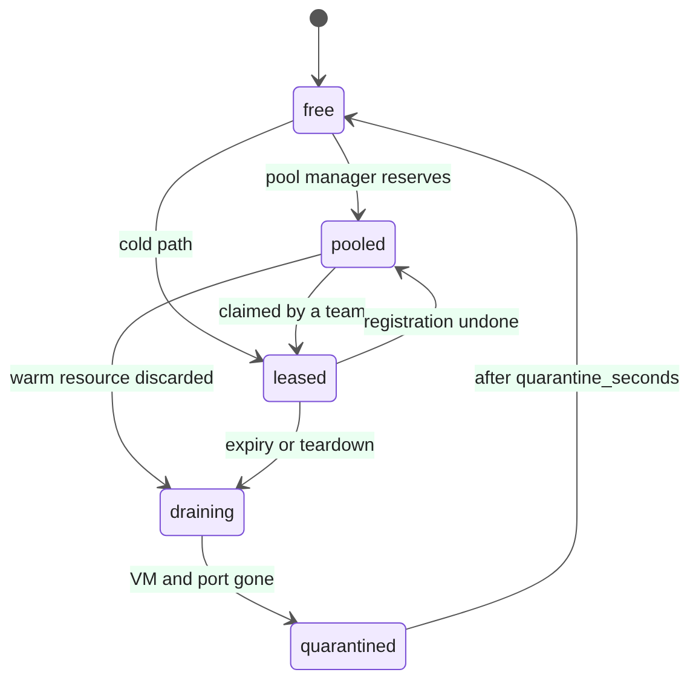
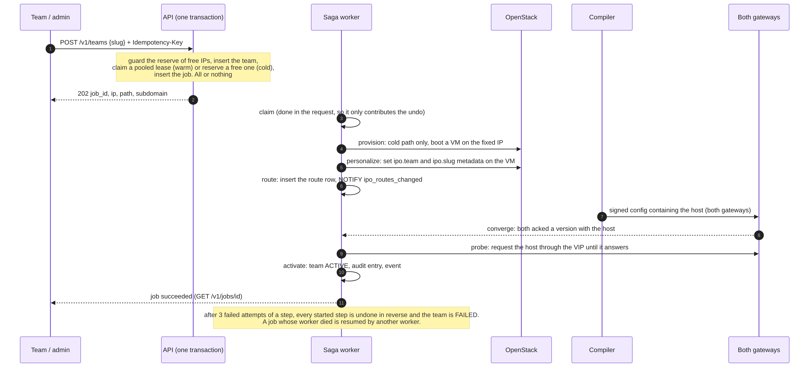

# Control plane

The control plane is one Python process (`python -m ipo.main`) that runs the API, the saga
workers and every controller. Run two replicas for availability; they coordinate through
PostgreSQL only.

## Structure

```
control-plane/ipo/
  api/            FastAPI app, models (OpenAPI source), auth, users, SSE stream, OpenAPI export
  domain/         rules that live next to the data: leases, registration, teardown, gateways,
                  signing, traffic, events
  controllers/    saga runner and its two sagas, config compiler and pusher, pool manager,
                  reaper, reconciler, worker loops
  adapters/       Cloud protocol: OpenStack SDK implementation and an in-memory fake;
                  prober (requests a host through the VIP); local agent double
  db/migrations/  seven versions, each as Alembic revision + plain SQL
  metrics.py      Prometheus gauges and histograms, computed at scrape time where possible
  main.py         wiring from environment variables
```

## Data model

| Table | Holds |
| --- | --- |
| `teams` | slug, subdomain, owner, state (`pending`, `active`, `draining`, `deleted`, `failed`), expiry |
| `leases` | one row per pool address: state, team, port id, server id, deadlines. A trigger enforces the legal transitions |
| `routes` | host to backend IP and port, per-route middlewares |
| `jobs`, `saga_steps` | durable jobs and the recorded progress of each step, with locking for workers |
| `config_versions` | every signed gateway config: version, SHA-256, signature, body, status |
| `gateway_status` | latest heartbeat per gateway: VRRP state, `vrrp_since`, live version |
| `traffic_buckets`, `traffic_recent` | per-minute counters per routed host; ring of recent requests |
| `users` | staff and team accounts (argon2id hashes) |
| `settings` | runtime-tunable values and the rollback pin, each change attributed |
| `audit_log` | append-only, hash-chained: each row's hash covers the previous row's |

## Lease state machine

A lease is one sandbox address and is always in exactly one state. The only legal transitions are
below; any other `UPDATE` is rejected by a database trigger with SQLSTATE `IPO01`, so no
application bug or raw SQL session can produce an illegal change
([ADR 2](../adr/0002-lease-state-machine.md)).



| State | Meaning |
| --- | --- |
| `free` | the address is unused |
| `pooled` | reserved for the warm pool; a VM is booted or booting on it |
| `leased` | owned by a team (one `leased` row per team, by a partial unique index) |
| `draining` | being torn down |
| `quarantined` | VM and port are gone; held for `lease.quarantine_seconds` (60 s) so a stale route or cache cannot reach the next owner |

All time comparisons use the database clock.

## Registration

`POST /v1/teams` with an `Idempotency-Key` does one short database transaction: guard, create
the team, claim a lease, create the job. Everything after that is a saga.



| Step | Does | Undo |
| --- | --- | --- |
| `claim` | already done in the request | return a warm VM to the pool, or release a cold one; mark the team `failed` |
| `provision` | cold path only: create the port and boot a VM on the reserved fixed IP (skipped if the lease already has one) | none of its own: the claim's undo releases a cold VM and port |
| `personalize` | set `ipo.team` and `ipo.slug` metadata on the VM | clear them |
| `route` | insert the route and `NOTIFY` the compiler | remove the route |
| `converge` | wait until **both** gateways have acknowledged a version containing the host | - |
| `probe` | request the host through the VIP until it answers | - |
| `activate` | team `ACTIVE`, audit entry, `team.active` event | - |

- **Warm vs cold.** A registration claims a `pooled` lease (a running VM): the **warm** path, seconds.
  If the pool is empty it reserves a `free` address and boots a VM: the **cold** path.
- **Guards.** The slug must be lowercase letters, digits and hyphens; the same key replayed returns the same job
  (`Idempotent-Replayed: true`) and a key reused for another slug is a `409`; registration is
  refused when it would leave fewer than `pool.reserve_free_ips` (5) addresses.
- **Resilience.** Each step's progress is written as it happens; a worker silent for 60 s loses
  its job to another; a step is retried up to 3 times with backoff, then every started step is
  undone in reverse; a job is retried up to 5 times overall. Steps must be idempotent because a
  resume can repeat one.

## Teardown

Shared by the reaper (expiry) and `DELETE /v1/teams/{id}`. Order matters: traffic stops first.

1. `drain`: team `draining`, route removed.
2. `await_route_removal`: both gateways acknowledge a config without the route. If one is down
   this logs and continues, because a dead gateway must not pin an address forever; quarantine
   and the reconciler's re-push bound the exposure.
3. `release`: delete the VM, then the port; lease to `quarantined`.
4. `finalize`: team `deleted`, audit entry, `team.deleted` event.

Teardown only moves forward (no undo); a job that fails is finished by the reconciler.

## Controllers

| Controller | Interval | Does |
| --- | --- | --- |
| **Pool manager** | periodic | keeps `pool.target_size` VMs booted on reserved addresses, at most `max_parallel_boots` at once, with exponential backoff (up to 5 min) on quota or cloud errors |
| **Config compiler** | on `NOTIFY` | renders, signs and pushes (see [gateway data flow](gateway-data-flow.md)); debounced |
| **Reaper** | 10 s | queues teardown for expired leases and frees quarantined addresses whose window has passed |
| **Reconciler** | 60 s | compares the database, OpenStack and the gateways and repairs drift, only after a 30 s grace so it never races a running saga |

Each controller runs on one replica at a time, chosen by a Postgres advisory lock.

### Reconciler rules

Each repair is idempotent and counted in `ipo_reconciler_repairs_total{rule}`.

| Rule | Found | Repair |
| --- | --- | --- |
| `orphan_port` | a port tagged `ipo` with no lease | delete it |
| `orphan_vm` | a tagged VM with no team that is not in the pool | delete it |
| `vm_gone` | lease `leased` but its VM does not exist | team `failed`, `alert.vm_gone`, start teardown |
| `stale_route` | a route for a team that is not `ACTIVE` | remove it |
| `stuck_lease` | `draining` or `quarantined` past its deadline | finish the transition |
| `stuck_team` | a `draining` team whose teardown job died | finish it |
| `gateway_behind` | a gateway's live version is below the latest | re-push |

The cloud is read once, first, and the database after, so a resource created between the two
reads is already recorded and is never mistaken for an orphan.

## API

All routes are under `/v1` and return JSON; errors are RFC 7807 `application/problem+json`. The
full contract is [`docs/api/openapi.json`](../api/openapi.json) (and a Postman collection).
Authentication is a bearer JWT from `POST /v1/auth/login`; roles form a ladder, and `team` is a
separate role that no staff route admits.

| Area | Routes | Lowest role |
| --- | --- | --- |
| Session | `POST /auth/login`; `GET /me` | public; any |
| Teams | `GET /teams`, `GET /teams/{id}`, `GET /jobs/{id}` | viewer |
| | `POST /teams`, `DELETE /teams/{id}`, `POST /teams/{id}/extend` | operator |
| | `POST /teams/{id}/users` (create a team login) | admin |
| Capacity | `GET /pool`, `GET /ipam` | viewer |
| Gateways | `GET /gateways` (includes `split_brain`) | viewer |
| | `POST /gateways/{name}/heartbeat`, `.../traffic`, `GET /config/latest` (used by agents) | operator |
| | `POST /gateways/failover` | admin |
| Config | `GET /config/versions`, `GET /config/versions/{n}`, `POST /config/rollback` | admin |
| Traffic | `GET /traffic`, `GET /traffic/recent` | viewer |
| Team self-service | `GET /me/traffic`, `/me/traffic/recent`, `/me/events` | team |
| Operations | `GET /settings`, `PATCH /settings`, `GET /audit` | admin |
| Live updates | `GET /events` (Server-Sent Events; token in the query for `EventSource`) | viewer |
| UI | `GET /ui` (the Grafana URL to embed) | viewer |
| Probes | `GET /healthz`, `GET /readyz`, `GET /metrics` | public |

Events on the stream: `team.active`, `team.draining`, `team.deleted`, `team.failed`,
`gateway.vrrp`, `gateway.split_brain`, `gateway.split_brain_resolved`, `alert.vm_gone`,
`traffic.batch`, plus lease and config-version changes. A team login receives a filtered stream
(`/me/events`) carrying nothing about other teams, gateways or addresses.

## Runtime settings

`PATCH /v1/settings` changes `pool_target`, `reserve_free_ips`, `lease_ttl_seconds`,
`quarantine_seconds` and `max_parallel_boots` (each range-checked) without a restart; each change is recorded with who made it and appears in the audit log. Values default
from `platform.yaml`.

## Audit

Every state-changing action writes an `audit_log` row whose hash covers the previous row's hash,
so editing or deleting history breaks the chain. `GET /v1/audit` returns the entries and whether
the chain is intact (and the first bad row if not).
