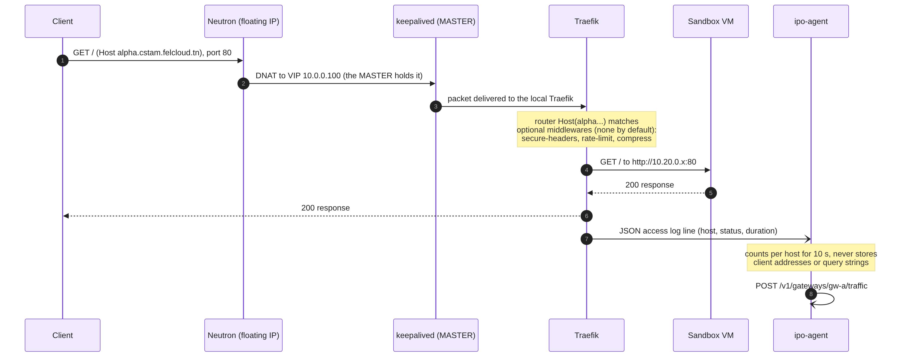
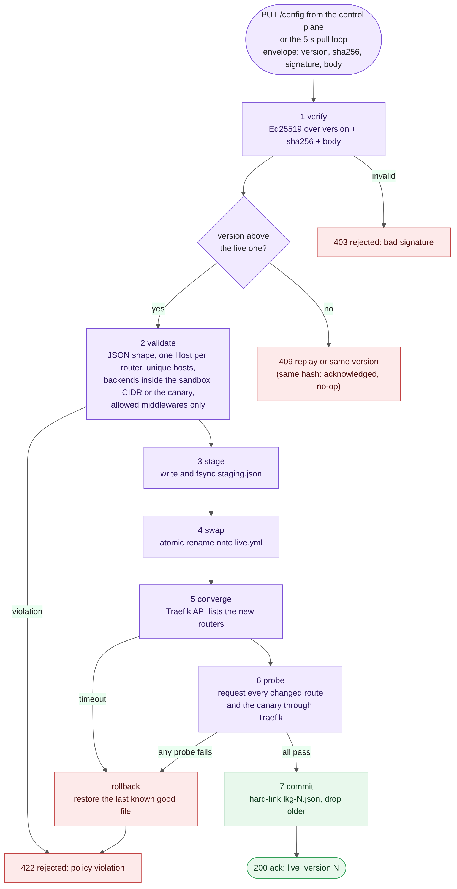

# Gateway data flow

What moves through a gateway, in which direction, in what format, and what happens when each
part fails. The diagram has three lanes; each section below walks one lane using the same
numbers and letters.


*Source: `docs/diagrams/gateway_data_flow.py` (SVG: `gateway-data-flow.svg`).*

A gateway is a VM with three network legs running keepalived, Traefik and `ipo-agent`. There are
two, `gw-a` and `gw-b`; only the VRRP MASTER receives requests, but both receive every config
version, so the standby is always ready.

## Lane 1: the request path

A visitor's request for `alpha.cstam.felcloud.tn`:

| Step | What happens |
| --- | --- |
| 1 | The browser resolves the team's name to the platform's floating IP and sends HTTP to port 80 |
| 2 | Neutron translates the floating IP to the VIP `10.0.0.100` (the `vip-edge` port) |
| 3 | The VIP is held by the VRRP MASTER only, so the packet reaches that gateway's Traefik |
| 4 | Traefik's `web` entry point matches the router whose rule is ``Host(`alpha.cstam.felcloud.tn`)`` and forwards to `http://<team ip>:80` over sandbox-net, applying the route's optional middlewares |
| 5 | The sandbox's response returns along the same path |
| 6 | Traefik appends one JSON line to `access.log` (host, method, path, status, bytes, duration) |

Properties worth knowing:

- Each gateway has its own legs; the sandbox sees the request come from the gateway's
  sandbox-net address (`10.20.0.2` or `.3`), which identifies which gateway served it (the demo
  uses this to show failover).
- A policy route on the gateways (`gateway_network` role) makes replies to edge-sourced traffic
  leave by the edge port. Without it, a request that reached a gateway through the router would
  be answered from the sandbox leg with an edge source address, and port security would drop it.
- Middlewares are opt-in per route and none by default: `secure-headers` (HSTS, nosniff,
  frame-deny), `rate-limit` (100 req/s average, burst 50), `compress`.
- Hosts that have no route get Traefik's own `404`. A route to a sandbox that is down gets `502`.



## Lane 2: the configuration path

A route changing (a team activates, is deleted, or an admin rolls back) becomes a new signed
config version on both gateways.

| Step | What happens |
| --- | --- |
| A | A saga (or an admin action) inserts or deletes a row in `routes` |
| B | PostgreSQL `NOTIFY ipo_routes_changed` wakes the compiler, which debounces bursts (0.1 s) |
| C | The compiler renders Traefik's dynamic config, computes its SHA-256, signs `version + hash + body` with Ed25519, stores it in `config_versions`, and `PUT`s it to **both** agents over mTLS. Each agent also polls `GET /v1/config/latest` every 5 s, which covers a missed push |
| 1 to 7 | Inside the agent, in order: **verify** the signature (403 if bad), **validate** the content, **stage** to `staging.json` (fsync), **swap** by atomic rename onto `live.yml`, **converge** (wait until Traefik's API lists the new routers), **probe** (request every route changed since the live config, plus the canary, through Traefik), **commit** (hard-link as `lkg-N.json`, drop older ones) |
| D | The agent answers `200` with its `live_version`. The version becomes `live` only when both gateways acknowledge it; if either refuses (policy 422), it is marked `rejected` |

**The compiled config** is a pure function of the routes: the same routes always produce the same
bytes, so an unchanged state never creates a new version. For two teams, one with a middleware:

```json
{"http": {
  "middlewares": {"secure-headers": {"headers": {"contentTypeNosniff": true, "frameDeny": true,
                                                 "stsSeconds": 31536000}}},
  "routers": {
    "ipo-canary":               {"entryPoints": ["web"], "rule": "Host(`canary.cstam.felcloud.tn`)", "service": "ipo-canary"},
    "t-alpha-cstam-felcloud-tn": {"entryPoints": ["web"], "rule": "Host(`alpha.cstam.felcloud.tn`)", "service": "t-alpha-cstam-felcloud-tn"},
    "t-bravo-cstam-felcloud-tn": {"entryPoints": ["web"], "middlewares": ["secure-headers"],
                                  "rule": "Host(`bravo.cstam.felcloud.tn`)", "service": "t-bravo-cstam-felcloud-tn"}},
  "services": {
    "ipo-canary":               {"loadBalancer": {"servers": [{"url": "http://127.0.0.1:8082"}]}},
    "t-alpha-cstam-felcloud-tn": {"loadBalancer": {"servers": [{"url": "http://10.20.0.11:80"}]}},
    "t-bravo-cstam-felcloud-tn": {"loadBalancer": {"servers": [{"url": "http://10.20.0.12:80"}]}}}}}
```

(It is written as JSON with sorted keys; JSON is valid YAML, which is what Traefik's file
provider reads from `live.yml`.)

**What the agent refuses (policy 422)**, whatever the control plane signed: a config that is not
the expected shape, two routers for one host, a rule that is not exactly one ``Host(`name`)``, a
backend that is not inside the sandbox CIDR (or the one loopback canary address), a middleware
that is not on the allow-list, or a router that references a missing service.

**The canary** is a route (`canary.<domain>`) to a responder inside the agent
(`127.0.0.1:8082`). Probing it through Traefik proves the new config was loaded and routes end to
end even when no team has changed.



### Failure behaviour

| Event | Result |
| --- | --- |
| Signature does not verify | `403`; nothing touches `live.yml`; `IPOConfigSignatureRejected` pages |
| Content breaks the rules | `422` with the reason; not retried |
| Same version and hash again | acknowledged as a no-op; an older or equal version with a different hash is a `409` replay |
| Probe fails or Traefik does not converge in time | `live.yml` is restored from the last known good file, `422`, `IPOConfigRolledBack` warns; the control plane marks that version `rejected` until the next route change |
| Agent killed mid-swap | on start it resets `live.yml` to the newest `lkg-*` file (or an empty config) |
| An agent is unreachable | the push retries with backoff (5 attempts); the reconciler re-pushes a gateway that is behind |
| Control plane down | nothing changes; both gateways keep the last verified config |
| Operator rolls back | the control plane re-issues the earlier body under a **new, higher** version, so agents never see time go backwards |

## Lane 3: signals and telemetry

### VRRP state and liveness (I to L)

| Step | What happens |
| --- | --- |
| I | keepalived runs its notify hook on every state change; the hook atomically writes `MASTER`, `BACKUP`, `FAULT` or `STOPPED` to `/run/ipo/vrrp_state` |
| J | `ipo-agent` reads that file (two consecutive identical reads before a change counts, so a half-written file cannot cause a spurious state) |
| K | Every 5 s the agent `POST`s `/v1/gateways/<name>/heartbeat` with `{vrrp_state, live_version}`, authenticated as an operator |
| L | The control plane upserts `gateway_status` (state, live version, `vrrp_since`, `last_heartbeat`). The split-brain check reads it; the dashboard's Gateways page and the `ipo_gateway_masters` gauge show it |

### Traffic and metrics (M to P)

| Step | What happens |
| --- | --- |
| M | The agent tails Traefik's JSON access log and counts requests per host: total, status class (2xx to 5xx), bytes, summed duration. Only host, method, path **without the query string**, status, size and duration are read; client addresses and headers are never read |
| N | Every 10 s it `POST`s a batch to `/v1/gateways/<name>/traffic` (up to 500 hosts and 200 recent requests; excess hosts are dropped and counted). A failed POST is re-queued within a memory bound. The canary's own probes are ignored |
| O | The control plane keeps only hosts that have a route (so a scanner sending random `Host` headers cannot grow the tables): per-minute buckets for 26 h and a ring of the last 2,000 requests. Time is the server's, never the agent's |
| P | `/metrics` computes gauges from the database at scrape time, so every replica reports the truth: for example `ipo_team_requests_5m{team,class}` and `ipo_team_latency_ms_5m{team}` for teams that still have a route. Prometheus scrapes them; Grafana panels, the dashboard's Traffic page and alerts read them |

## Data inventory

| Data | Where it lives | Written by | Kept |
| --- | --- | --- | --- |
| Routes | `routes` | sagas | while the team is active |
| Config versions (body, SHA-256, signature, status) | `config_versions` | compiler | forever (history, rollback source) |
| Live config on a gateway | `live.yml`, `lkg-N.json` | agent | newest known good only |
| VRRP state | `/run/ipo/vrrp_state`; `gateway_status` | keepalived hook; control plane | latest |
| Access log | `/var/log/traefik/access.log` | Traefik | local, rotated by the host |
| Traffic counters | `traffic_buckets`, `traffic_recent` | control plane, from agent batches | 26 h, last 2,000 |
| Audit trail | `audit_log` (hash-chained) | every state-changing action | forever; integrity checked by `GET /v1/audit` |

## Failover, as seen by this diagram

When the MASTER fails, lane 1 changes only in step 3: the VIP, and therefore the traffic, moves
to the other gateway. Lanes 2 and 3 are unaffected, because both gateways already hold the same
config version and both report. The new MASTER's first heartbeat tells the control plane which
gateway now serves, and the traffic reporter on that gateway starts counting the requests it now
receives.
