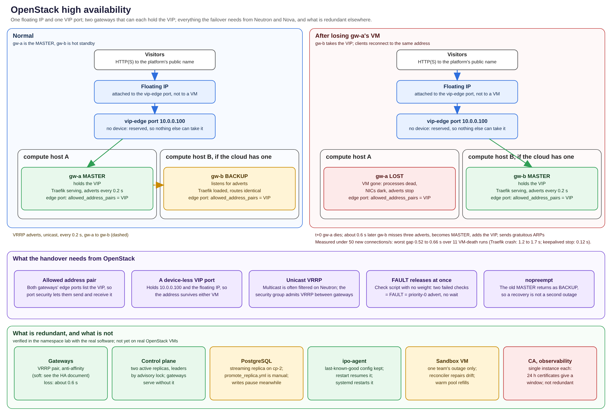
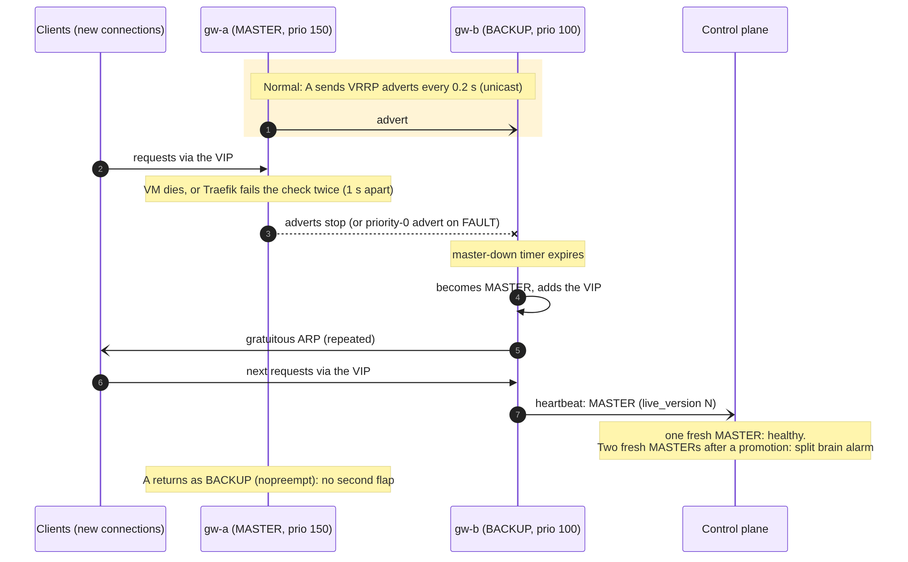

# OpenStack high availability

How the platform stays up on OpenStack when a gateway, a proxy, the control plane or the database
fails: what each failure costs, how it is detected, and what the evidence is.

*Source: `docs/diagrams/openstack_ha.py`.*

## Targets

| Objective | Target | Measured (lab) |
| --- | --- | --- |
| Gateway VM dies | VIP moves in about 2 s | **0.52 to 0.66 s** worst request gap (11 runs) |
| Traefik crashes or hangs | about 4 s | **1.2 to 1.7 s** (SIGKILL, SIGTERM, 12 runs) |
| keepalived stopped cleanly | immediate | **0.12 s** |
| Manual failover through the control plane | under 1.5 s | **0.12 s** |
| Old MASTER comes back | no second outage | **0 s**, no flap (nopreempt) |
| Both gateways claim MASTER (partition) | detected within seconds | alarm in about 5 s; one MASTER again after healing |
| Control plane down | gateways keep serving | verified: config pipeline works with no control plane |

*Method:* the lab runs real keepalived 2.4, Traefik 3.7 and `ipo-agent`, and sends 50 new TCP
connections per second through the VIP; a "gap" is the longest stretch in which no request
succeeded. See `tests/chaos/` and `uv run python -m chaos.run`. These numbers come from Linux
bridges in network namespaces, **not from OpenStack VMs** (see [limits](#known-limits-and-risks)).

## OpenStack resources behind the design

Built by `infra/pulumi` from `platform.yaml` and `security-groups.yaml`.

| Need | OpenStack object | Detail |
| --- | --- | --- |
| Three isolated networks | `edge-net`, `sandbox-net`, `mgmt-net` + subnets | sandbox-net: DHCP off, allocation pool = the IPAM range |
| Reach the internet | routers `r-edge` (edge + sandbox) and `r-mgmt` | external gateway on `INTERNET`, SNAT |
| An address that survives a gateway | port `vip-edge` (no device) + floating IP | the VIP is reserved, so nothing else can take it |
| Let either gateway use the VIP | `allowed_address_pairs` on both gateways' edge ports | otherwise port security drops VIP traffic |
| No spoofing | `port_security_enabled` on every port and network | enforced by the CrossGuard policy `port-security-on` |
| Network policy | 9 security groups, 38 rules, remote-group references | one Neutron group per spec group and network, e.g. `sg-gateway.edge` |
| Keep a pair apart | server groups `gateways-anti`, `control-plane-anti` | `soft-anti-affinity` by default (see risks) |
| Boot with no metadata service | config drive | sandbox-net has no DHCP and no metadata route |
| Inventory by role | server metadata `role=<name>` | enforced by CrossGuard `vm-has-role` |

## How the gateway failover works

Both gateways run keepalived in `BACKUP` state with `nopreempt`; gw-a has priority 150 and
becomes MASTER first, gw-b has 100.

1. **Adverts.** The MASTER sends a VRRPv3 advert to its peer every 0.2 s, unicast (multicast is
   often filtered on Neutron). The security group admits VRRP only between the gateways.
2. **Detection, machine failure.** The BACKUP declares the MASTER down after missing three
   adverts (about 0.6 s plus a priority-dependent skew), then takes the VIP.
3. **Detection, proxy failure.** keepalived runs a check against Traefik's ping endpoint every
   1 s; two failures in a row put the instance in `FAULT`. The check has no weight, so `FAULT`
   makes keepalived send a priority-0 advert and release the VIP at once, instead of lowering
   its priority and waiting for a preempt that `nopreempt` forbids.
4. **Takeover.** The new MASTER adds `10.0.0.100/24`, sends gratuitous ARPs (after 1 s, repeated
   five times, refreshed every 30 s) so neighbours and Neutron converge, and its notify hook
   writes `MASTER` to `/run/ipo/vrrp_state`.
5. **Report.** `ipo-agent` reads that file and heartbeats the control plane every 5 s.
6. **Recovery.** The old MASTER returns as BACKUP. Because of `nopreempt` the VIP stays where it
   is, so recovery is not a second outage.

A deliberate failover (`POST /v1/gateways/failover`, admin) writes a non-zero value to
keepalived's track file through the agent (`POST /fault`), which has the same effect as step 3.
`DELETE /fault` (or removing `/run/ipo/fault`) lifts it. Restarting the agent does not.

## Split brain

If the gateways cannot hear each other (a partition) both can become MASTER and both add the VIP.
The platform detects this rather than preventing it:

- Each agent reports its VRRP state and the time it last changed (`vrrp_since`).
- The control plane counts gateways whose latest heartbeat is MASTER and fresh (within 15 s). Two
  qualify as a split brain only if both have reported since the newest promotion: a gateway that
  died as MASTER stops reporting, so the survivor taking over is not an alarm.
- It raises `ipo_gateway_masters > 1`, increments `ipo_split_brain_total`, emits a
  `gateway.split_brain` event (and `…_resolved` later), shows a banner in the dashboard and fires
  the `IPOGatewaySplitBrain` alert after 5 s.
- Healing the partition lets VRRP re-elect by priority; the lab verifies a single MASTER and a
  single VIP holder afterwards.

## Everything else that can fail

| Failure | Effect on teams | Detection | Recovery |
| --- | --- | --- | --- |
| Gateway VM or Traefik | under 2 s of failed new connections | VRRP, check script | automatic; Quadlet and systemd restart the process |
| `ipo-agent` crashes | none; Traefik keeps its config | the Gateways page shows a stale heartbeat; a restart shows as flapping | systemd restarts it; it resets `live.yml` to its last known good |
| Control plane replica | none; the other replica serves | `/readyz`, Prometheus | automatic; saga jobs resume on the survivor |
| Both control-plane replicas | no new registrations or teardowns; **existing sites keep serving** | `/readyz`, alerts | restart; the reconciler repairs drift on return |
| PostgreSQL primary | control plane stops writing; sites keep serving | `/readyz` | `playbooks/promote_replica.yml` (manual) – [runbook](../runbooks/promote-replica.md) |
| A team's sandbox VM | that team only | reconciler: lease `leased` but VM gone | team marked failed, teardown started, alert `alert.vm_gone` |
| Bad config pushed | none | agent probe fails | agent rolls back to last known good; `IPOConfigRolledBack` |
| Forged or corrupted config | none | signature check | rejected 403; `IPOConfigSignatureRejected` pages |
| step-ca (cp-1) | none for 24 h | renewal timer errors | restore cp-1; certificates are valid 24 h and renew when 8 h remain |
| Observability (cp-2) | none | – | restart; not redundant |
| OpenStack API outage | no new VMs; existing traffic unaffected | saga failures | sagas retry with backoff; pool backs off |

### Control plane internals that make it safe to run twice

- **Workers** claim jobs with row locks; a job whose worker has been silent for 60 s is picked
  up by another and resumed from the last completed step.
- **Controllers** (compiler, pool manager, reaper, reconciler) each run in one replica at a
  time, chosen by a Postgres advisory lock; if that replica dies, the other takes the lock.
- **Everything that matters is in PostgreSQL**; replicas hold no state.

## Findings from the real FelCloud cloud

Two things the first real `pulumi up` showed that no test could:

- **Hard anti-affinity failed.** The four VMs in `anti-affinity` server groups went to `ERROR`
  while the two without a group booted, which fits a single compute host in TN-Carthage. The
  default is now `soft-anti-affinity`, which separates the pair when it can. **If the cloud has
  one host, a host failure takes both gateways at once**; failover protects against VM and
  process failure, not host failure. Ask FelCloud how many hosts back the zone.
- **No floating IPs.** The `INTERNET` pool answers every allocation with
  `ExternalIpAddressExhausted`, although the routers got gateway addresses from it. The program
  builds without the two public addresses when told (`ipo:floatingIps=false`). Until FelCloud
  frees addresses the platform has no public entry point.

## Known limits and risks

| Risk | Status |
| --- | --- |
| VRRP between two real OpenStack VMs is **untested**: the lab uses Linux bridges. Neutron must deliver VIP traffic to whichever port lists it as an allowed address pair and learn the move from the gratuitous ARPs. | needs the Ansible roles run on the built VMs |
| One compute host would defeat the gateway pair (soft anti-affinity) | ask FelCloud; documented |
| PostgreSQL promotion is manual; there is no automatic fencing beyond the playbook stopping the old primary | accepted for the challenge; runbook exists |
| step-ca and observability are single instances | accepted; 24 h certificate window |
| Agents log in to the API with an operator account; a compromised gateway would hold operator rights | a narrower `gateway` role would close it |
| Instance quota (50) caps sandboxes at about 44 | documented; ask for more before a load test |
