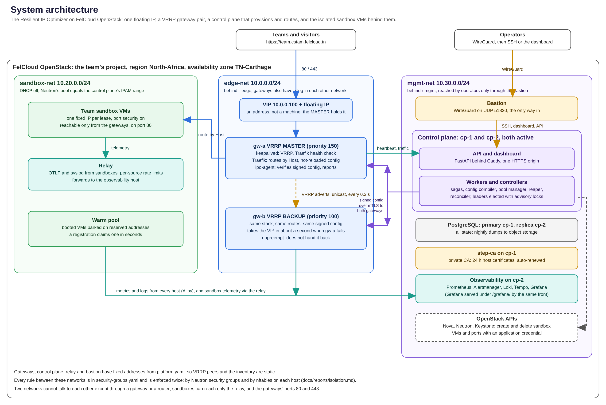

# System architecture

The Resilient IP Optimizer gives every team in the CSTAM 3.0 challenge an isolated sandbox VM on
FelCloud OpenStack and a stable public subdomain (`<team>.cstam.felcloud.tn`), all behind one
floating IP. A pair of gateways shares that address so the platform keeps serving when a gateway
VM or its proxy dies, and a control plane creates, routes, repairs and removes sandboxes
automatically.

*Source: `docs/diagrams/system_architecture.py` (SVG: `system-architecture.svg`).*

## What it does, in one paragraph

A team registers (`POST /v1/teams`). The control plane claims a pre-booted VM from a warm pool,
adds a route for `<team>.cstam.felcloud.tn`, signs a new gateway configuration, and pushes it to
both gateways. Each gateway's agent verifies, validates, swaps in and probes the new config
without restarting Traefik; once both gateways acknowledge it, the team's subdomain answers from
its sandbox. When the lease expires (or the team is deleted) the route is removed first, then the
VM and port, then the address is quarantined and returned to the pool. If the active gateway
dies, the other takes over the virtual IP in about a second.

## Components

| Component | Runs on | Technology | Responsibility |
| --- | --- | --- | --- |
| **Gateway pair** (`gw-a`, `gw-b`) | edge-net, sandbox-net, mgmt-net | keepalived, Traefik 3, `ipo-agent` | Hold the VIP (VRRP), terminate HTTP, route by `Host` to sandboxes |
| **ipo-agent** | each gateway | Go, standard library only | Accept signed config, verify, validate, swap, probe, roll back; heartbeat; report traffic |
| **Control plane** (`cp-1`, `cp-2`) | mgmt-net | Python 3.12, FastAPI, psycopg | API, sagas, config compiler, warm pool, reaper, reconciler, audit |
| **Dashboard** | served by the control plane's front | React 19, TypeScript, Tailwind 4 | Staff console and a per-team page |
| **PostgreSQL** | cp-1 primary, cp-2 replica | PostgreSQL 18 | All state; triggers enforce the lease state machine and the audit chain |
| **step-ca** | cp-1 | smallstep CA | 24 h host certificates for mTLS, renewed automatically |
| **Observability** | cp-2 | Prometheus, Alertmanager, Loki, Tempo, Grafana | Metrics, alerts, logs, traces, dashboards |
| **Relay** | sandbox-net and mgmt-net | Grafana Alloy | Takes telemetry from untrusted sandboxes, rate-limited per source |
| **Bastion** | mgmt-net, floating IP | WireGuard | The only way in for operators |
| **Sandbox VMs** | sandbox-net | the baked `ipo-sandbox-vN` image | The teams' workloads, one fixed IP each |

The containerised services (Traefik, the control plane and its web front, PostgreSQL, step-ca, the
observability stack) run as rootless Podman Quadlets (`quadlets/`); keepalived, `ipo-agent`,
Alloy and WireGuard are ordinary system services.

## Networks and addressing

All addresses are fixed in `platform.yaml`, so VRRP peers, the Ansible inventory and the firewall
rules are static.

| Network | CIDR | Router | Holds |
| --- | --- | --- | --- |
| `edge-net` | 10.0.0.0/24 | `r-edge` (external gateway) | the VIP `10.0.0.100`, gateway edge ports `.11` and `.12` |
| `sandbox-net` | 10.20.0.0/24, DHCP off | `r-edge` | gateway legs `.2`, `.3`; relay `.4`; sandboxes `.10`-`.109` (the IPAM range) |
| `mgmt-net` | 10.30.0.0/24 | `r-mgmt` (external gateway) | bastion `.10`, gateways `.11`/`.12`, `cp-1` `.21`, `cp-2` `.22`, relay `.31` |

Neutron's allocation pool on sandbox-net is exactly the control plane's IPAM range, so the cloud
never hands out an address the control plane also leases.

## Design decisions

The numbered ADRs in [`docs/adr`](../adr) record the reasoning; the ones that shape everything:

1. **One source of truth per concern.** `platform.yaml` (sizes, addresses, timings, flavors) and
   `security-groups.yaml` (every allowed flow) are read by Pulumi, Ansible, the control plane, the
   agents and the tests. A rule or address is changed in one place and a test fails if a layer
   disagrees ([ADR 3](../adr/0003-one-network-policy-two-enforcers.md)).
2. **The database enforces the lease state machine.** A `BEFORE UPDATE` trigger rejects illegal
   transitions, so no application bug or second writer can double-lease an address
   ([ADR 2](../adr/0002-lease-state-machine.md)).
3. **Long operations are sagas.** Registration and teardown record each step; a dead worker's job
   is resumed by another, a failing step is undone in reverse, and steps are idempotent.
4. **Config is signed and the agent is the last line of defence.** The control plane signs every
   gateway config with Ed25519; the agent verifies it and independently re-validates the content
   (only Host rules, backends only inside the sandbox CIDR), so a compromised control plane
   cannot point a gateway at an arbitrary address.
5. **Gateways do not need the control plane to serve.** They keep the last verified config and
   restore it on restart; the control plane is on the config path, never the request path.
6. **Isolation is enforced twice.** Neutron security groups and per-host nftables are generated
   from the same file and tested separately and together
   ([isolation results](../reports/isolation.md)).
7. **Containers on the host network, rootless** ([ADR 4](../adr/0004-rootless-quadlets-on-the-host-network.md)),
   so the host firewall is exactly what guards each port.
8. **The cloud is behind an interface.** The control plane talks to OpenStack through a `Cloud`
   protocol with an SDK implementation and an in-memory fake, which is what makes the whole flow
   testable without a cloud.

## Technology choices

| Choice | Why |
| --- | --- |
| Traefik file provider | Hot reload from an atomically replaced file; no API to secure |
| keepalived, unicast VRRP | Standard, sub-second failover; multicast is often filtered on Neutron |
| Ed25519 signatures | Small, fast, no parameters to get wrong; the public key is the only thing agents hold |
| Postgres `LISTEN/NOTIFY` and advisory locks | Debounced recompile on route change; leader election without another service |
| Podman Quadlet | Declarative units with health checks and auto-update rollback, no daemon |
| Pulumi (Python) | One language for the infra and its tests; policy-as-code with CrossGuard |
| Go for the agent | One static binary with no runtime on a security-sensitive host |

## Capacity and limits

The FelCloud project allows 50 instances, 128 cores, 256 GB RAM, 10 floating IPs and 100
security-group rules ([survey](../reports/felcloud-survey.md)). The platform itself uses 6 VMs,
10 cores, 12 GB, 2 floating IPs and 38 rules. The sandbox pool holds 100 addresses, but the
instance limit is the real ceiling: about 44 sandboxes, warm pool included. Registration refuses
to drop below a reserve of free addresses (`pool.reserve_free_ips`) but does not know about the
instance limit; a burst past it fails at Nova.

## Security in brief

Roles `viewer` < `operator` < `admin` plus a separate `team` role that no staff route admits;
argon2id passwords; short-lived JWTs; mTLS between control plane and agents with 24 h
certificates; secrets as Podman secrets; a hash-chained audit log. Network isolation, the threat
table and key handling are in [security.md](security.md).

## What is verified, and what is not

| Verified | How |
| --- | --- |
| Control plane flows (registration, teardown, reconciler, roles, config pipeline) | 300+ unit and integration tests against a real PostgreSQL |
| Gateway failover, config hot-reload, traffic accounting, split-brain detection | real keepalived, Traefik and `ipo-agent` in a rootless namespace lab, under load |
| Network isolation, both enforcement layers and each alone | namespace lab with 1,683 probes per pass |
| Every Ansible template, Quadlet and observability config | read by the real program at the pinned version |
| `pulumi up` and `destroy` | run against the real FelCloud project (86 resources, VMs ACTIVE in about 45 s) |

| **Not** verified | Why |
| --- | --- |
| Ansible roles on real VMs; VRRP between two real OpenStack VMs | no configured hosts yet; the build has no public floating IP (the project's pool is exhausted) and no bastion path |
| `podman auto-update` rollback, step-ca enrollment end to end, Postgres replication between hosts, WireGuard | no Podman runtime or second host was available |
| Behaviour with real teams, and the instance limit under a burst | not exercised |

## Repository map

| Path | Contents |
| --- | --- |
| `control-plane/` | the Python service, migrations, Containerfile, 300+ tests |
| `gateway-agent/` | the Go agent and a dev gateway |
| `dashboard/` | the React console |
| `infra/pulumi/` | day-0 infrastructure, CrossGuard policies, mocked tests |
| `ansible/` | day-1 roles and playbooks, inventory, filter plugin |
| `quadlets/` | day-2 container units |
| `observability/` | alert rules, dashboard generator and dashboards |
| `tests/` | chaos lab, isolation lab, deploy checks, the demo |
| `docs/` | this documentation |
| `platform.yaml`, `security-groups.yaml` (+ schemas) | the single sources of truth |
